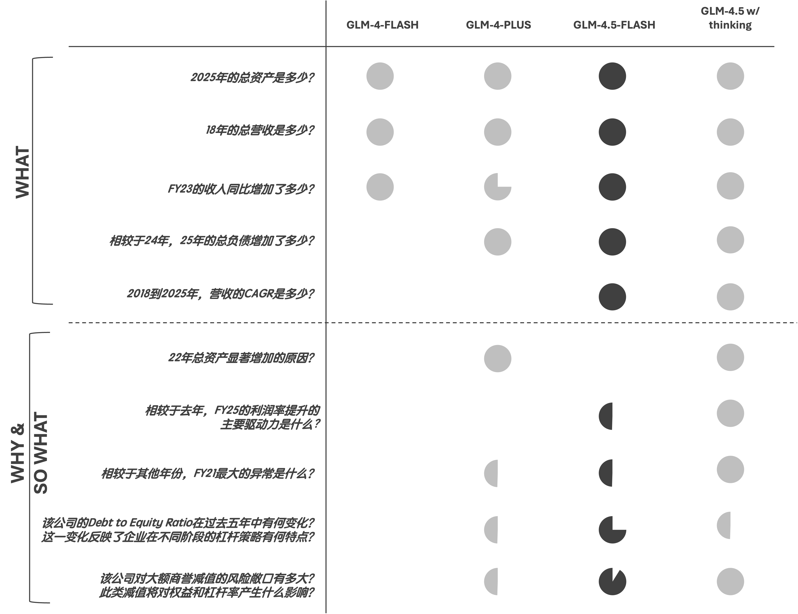
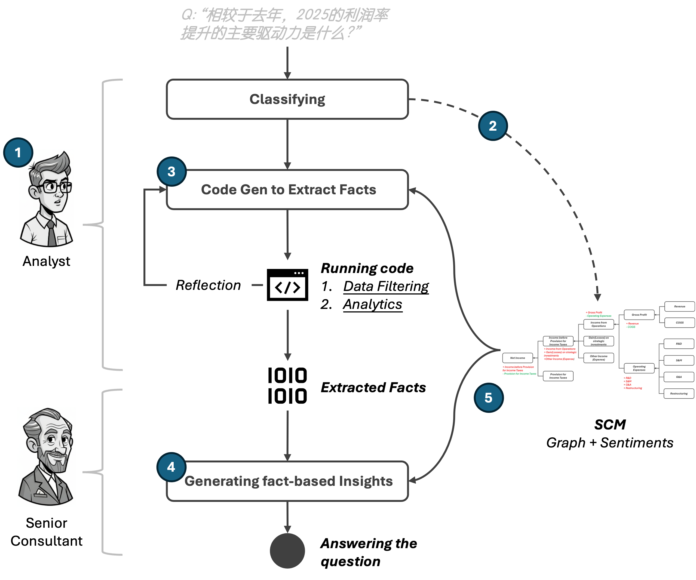

The agent is designed to harness free-tier LLMs to deliver in-depth insights into “why” and “so what” questions. By integrating causal structures, it achieves performance comparable to state-of-the-art LLMs.

# Evaluation

# Architecture

# Get Started
Setup your auth in a local '.env' file: 
```
GLM_API_KEY = "Your GLM key"
```
Then following below commands to run the app: 

```bash
git clone https://github.com/Laoyu84/causal_glm_flash.git
cd causal_glm_flash
python -m venv venv
source venv/bin/activate
pip install -r requirements.txt
python app.py